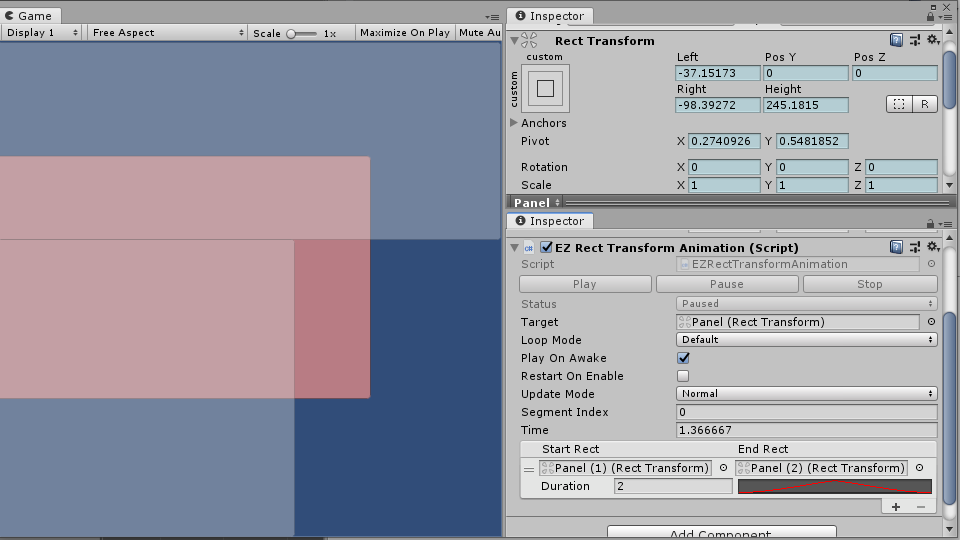
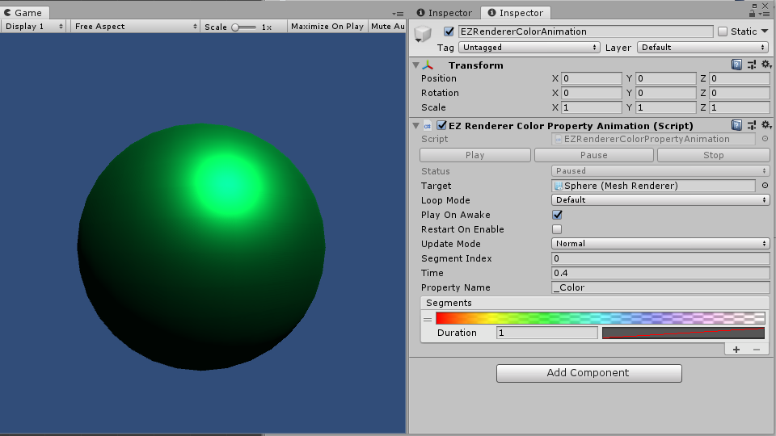

# EZAnimation

This package is totally **FREE** and open-source.  
If you feel it helpful, you can buy it on [AssetStore](https://assetstore.unity.com/packages/slug/151631) to support me. Other than that, [Donations](https://github.com/EZhex1991/Receipts) are always welcome.

[View it on GitHub](https://github.com/EZhex1991/EZAnimation)  
[查看中文介绍](README_CN.md)  

A interpolation animation component collection

The design aimed to create simple, stateless, interpolation animations easily.  
Most of the effects could be easily implemented by Update, Coroutine, DOTween, etc, but that's hard to be configured or adjusted in runtime.

## EZAnimation Components

`EZAnimation` is the base class of all other animation components, the time(process) of the animation progress is updated here, you only need to define your own animation segments and apply changes to your target by override `OnSegmentUpdate` function.

``` C#
[Serializable]
public class EZColorSegment : EZAnimationSegment
{
    [SerializeField]
    private Gradient m_Gradient = EZAnimationUtility.GradientFadeOut();
    public Gradient gradient { get { return m_Gradient; } set { m_Gradient = value; } }

    public Color Evaluate(float time)
    {
        return gradient.Evaluate(time);
    }
}
public class EZGraphicColorAnimation : EZAnimation<Graphic, EZColorSegment>
{
    protected override void OnSegmentUpdate()
    {
        target.color = activeSegment.Evaluate(segmentProcess);
    }
}
```

## Segment

The animation data is a list of `Segment`, or, you can say a segment is a piece(clip) of the whole animation.  
The base segment class `EZAnimationSegment` contains duration and time curve, you can append it as your need.  
I created CustomEditor for each of my `EZAnimation` components, so that you can easily add, remove, and reorder the segment list.  

## Playables

The playables is an additional way to control the animation, you will need it when you work with the Timeline feature, and, you can simply remove the "EZAnimation/Runtime/Playables" folder if you don't need it.

---

All the source code is available, and I tried my best to make the name of the variables readable, so I believe this is enough for a README.
If you have further questions, just create an issue.

- EZTransformAnimation


- EZRectTransformAnimation



- EZGraphicColorAnimation


- EZRendererColorPropertyAnimation


