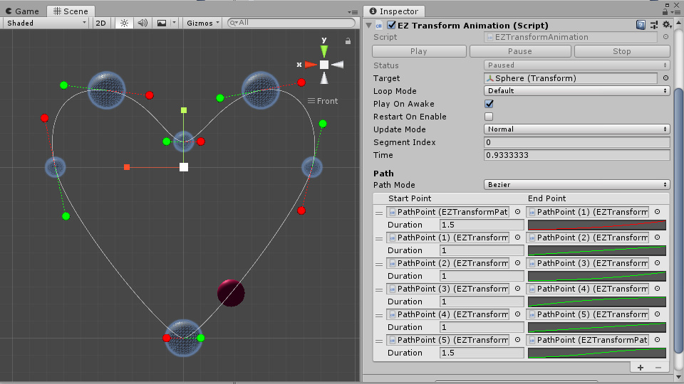
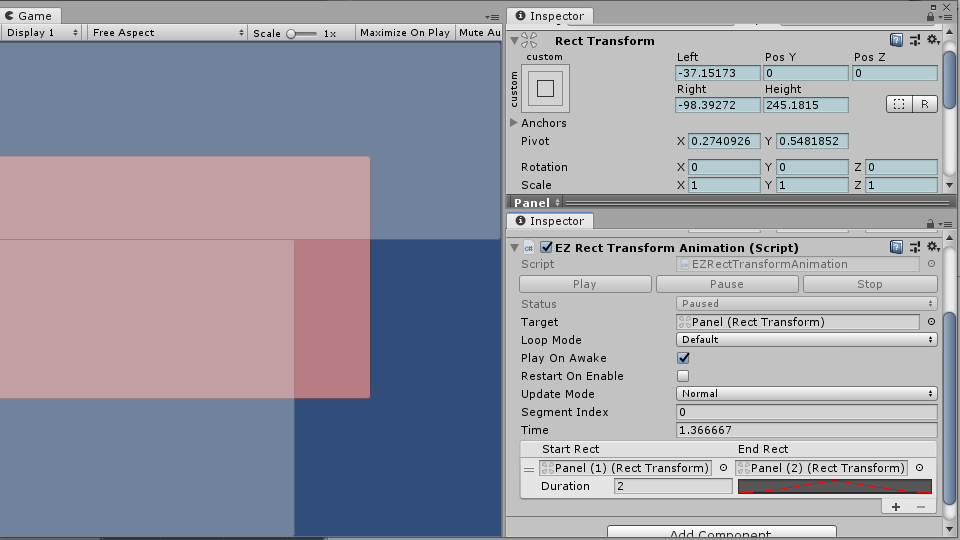
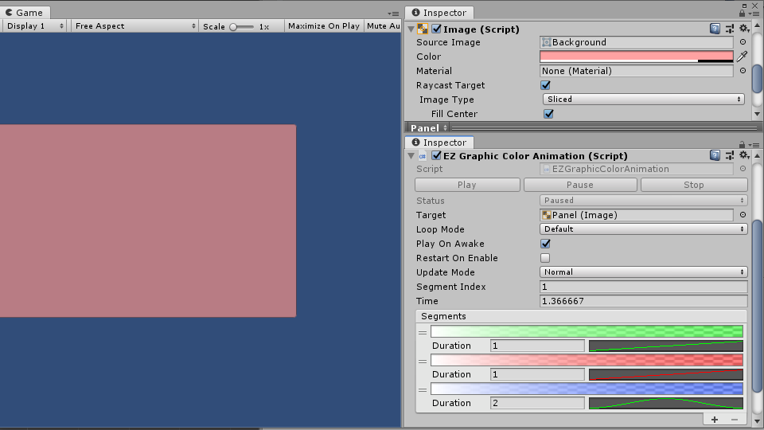
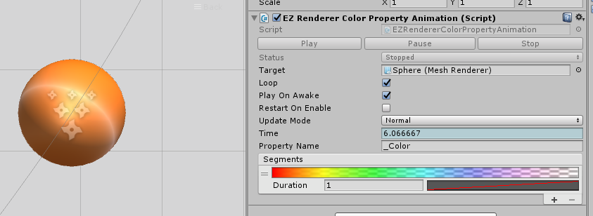

# EZAnimation

该资源完全**免费**并开源。  
如果你觉得它对你有所帮助，你可以在[AssetStore](https://assetstore.unity.com/packages/slug/151631)上购买它来表示对作者的支持。或者，你可以选择其他方式表示[感谢](https://github.com/EZhex1991/Receipts)。

[View it on GitHub](https://github.com/EZhex1991/EZAnimation)  
[English Version](README.md)  

一些插值动画组件

设计初衷是用它来实现一些简单的、无状态插值动画。  
对于这些简单的动画控制，一般来说可以在代码中用协程或者DOTween实现，但这个方式不太友好，运行时调整起来比较闹心。

## EZAnimation 组件

`EZAnimation`是所有动画实现的基类，主要实现了时间和动画进程的更新，你只需要实现自己的Segment，并通过重写`OnSegmentUpdate`方法来更改动画的Target就能创建自己的动画组件。

``` C#
[Serializable]
public class EZColorSegment : EZAnimationSegment
{
    [SerializeField]
    private Gradient m_Gradient = EZAnimationUtility.GradientFadeOut();
    public Gradient gradient { get { return m_Gradient; } set { m_Gradient = value; } }

    public Color Evaluate(float time)
    {
        return gradient.Evaluate(time);
    }
}
public class EZGraphicColorAnimation : EZAnimation<Graphic, EZColorSegment>
{
    protected override void OnSegmentUpdate()
    {
        target.color = activeSegment.Evaluate(segmentProcess);
    }
}
```

## Segment

动画数据就是一个`Segment`的列表，或者，你可以说一个segment是动画中的一个小片段。
基类`EZAnimationSegment`中仅包含duration和curve，你可以在你的segment中根据需要扩展它。  
目前其中已有的动画组件我都做了对应的CustomEditor，所以你可以很方便的在其中对segment列表进行增删改。

## Playables

这个为了使用Timeline来控制动画时间的附加功能，如果你不需要它可以直接移除"EZAnimation/Runtime/Playables"目录。

---

所有代码都可见，代码中的变量名应该也不难理解。
如果有其它疑问，请提交issue。

- EZTransformAnimation



- EZRectTransformAnimation



- EZGraphicColorAnimation



- EZRendererColorPropertyAnimation


